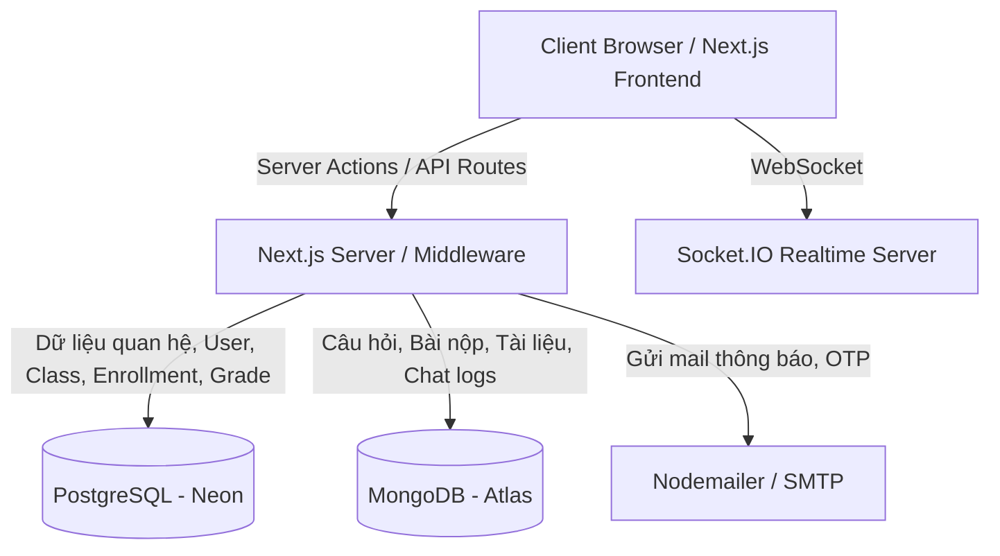
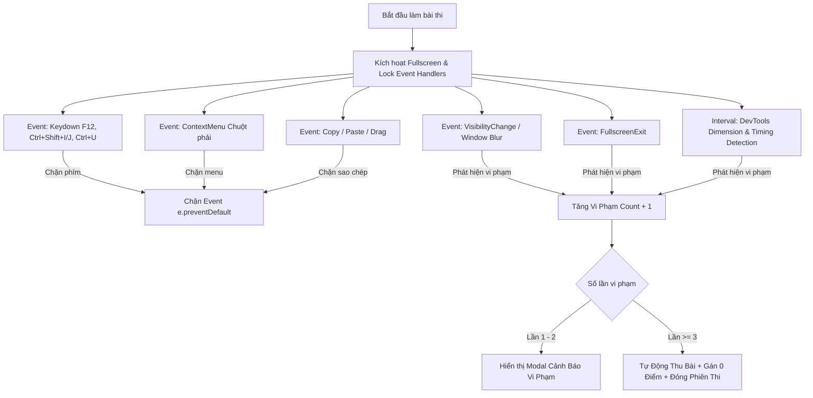
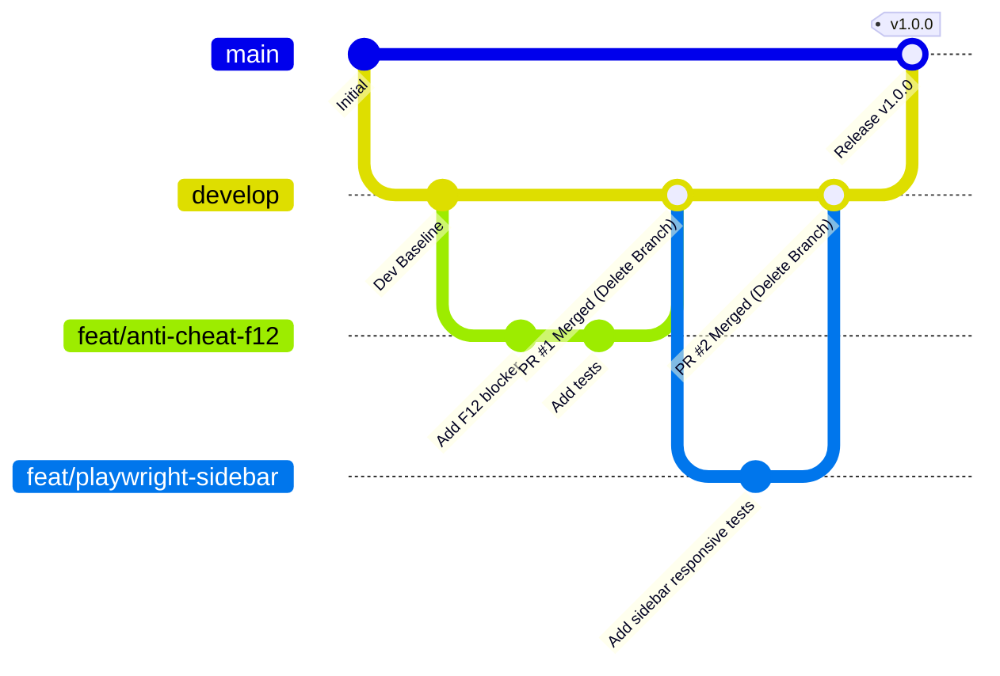

# AGENT.MD - SELFMOOC SYSTEM GUIDELINES & SPECIFICATIONS

Tài liệu hướng dẫn toàn diện dành cho AI Agent và lập trình viên trong quá trình phát triển, kiểm thử, triển khai và bảo trì hệ thống **SelfMOOC** (Hệ thống quản lý học tập trực tuyến - Learning Management System).

---

## 1. TỔNG QUAN HỆ THỐNG & CÁC TÍNH NĂNG HIỆN CÓ

SelfMOOC là nền tảng LMS hiện đại hỗ trợ 3 phân quyền người dùng: **Học sinh (Student)**, **Giáo viên (Teacher)** và **Phụ huynh (Parent)**. Hệ thống kết hợp kiến trúc Next.js App Router (Server Actions + Client Components) cùng mô hình đa cơ sở dữ liệu (**PostgreSQL** cho dữ liệu quan hệ/nghiệp vụ cốt lõi và **MongoDB** cho dữ liệu phi cấu trúc/nội dung học tập/chat).



### 1.1. Danh mục tính năng hiện có

| Phân hệ (Module) | Tính năng chi tiết | Phân quyền áp dụng |
| :--- | :--- | :--- |
| **Authentication & Profile** | Đăng ký, đăng nhập JWT qua HTTP-only cookies, cập nhật thông tin cá nhân, đổi mật khẩu, đăng xuất an toàn. | Student, Teacher, Parent |
| **Quản lý Lớp học (Classes)** | Tạo lớp học, quản lý mã lớp (join code), duyệt học sinh, xem danh sách thành viên. | Teacher, Student |
| **Khóa học & Học liệu (Courses & Materials)** | Quản lý giáo trình, tài liệu bài giảng (PDF/Doc/Video), phân loại theo chương mục. | Teacher (Quản trị), Student (Xem/Tải) |
| **Ngân hàng câu hỏi (Question Bank)** | Tạo/sửa câu hỏi trắc nghiệm (Multiple Choice), Đúng/Sai (True/False), Tự luận (Essay), hỗ trợ hình ảnh và phân bổ điểm. | Teacher |
| **Bài tập & Đề thi (Assignments & Quizzes)** | Giao bài tập về nhà / Đề kiểm tra có giới hạn thời gian, quy định hạn nộp. Giao diện làm bài trực tuyến với thanh điều hướng câu hỏi, đồng hồ đếm ngược. | Teacher (Tạo), Student (Làm bài) |
| **Chấm điểm (Grading)** | Tự động chấm câu hỏi trắc nghiệm và Đúng/Sai. Giao diện giáo viên chấm điểm thủ công câu tự luận, nhận xét và công bố điểm. | Teacher |
| **Giám sát gian lận cơ bản** | Đếm số lần chuyển tab (`document.visibilitychange`). Quá 3 lần tự động nộp bài và gán 0 điểm. | Student (Khi làm bài kiểm tra) |
| **Điểm danh & Thời khóa biểu (Attendance & Schedule)** | Quản lý lịch học theo tuần/tháng, điểm danh trạng thái (Có mặt / Vắng / Muộn). | Teacher, Student |
| **Thông báo lớp học (Announcements)** | Đăng tin tức, thông báo quan trọng trong phạm vi lớp học. | Teacher (Đăng), Student (Đọc) |
| **Nhắn tin thời gian thực (Realtime Chat)** | Trò chuyện 1-1 giữa Giáo viên - Học sinh - Phụ huynh qua Socket.IO. | Student, Teacher, Parent |
| **Liên kết Gia đình (Family Portal)** | Phụ huynh liên kết với con cái qua mã học sinh để theo dõi điểm số, chuyên cần, tiến độ học tập và bài tập về nhà. | Parent |
| **Nhật ký học tập (Diary)** | Ghi chép cá nhân của học sinh trong quá trình học. | Student |

---

## 2. CÁC ĐIỂM CẦN HOÀN THIỆN ĐỂ ĐẠT CHUẨN PRODUCTION

### 2.1. Nâng cấp Hệ thống Giám sát Chống gian lận (Anti-Cheat System)
- **Hiện trạng:** Chỉ có kiểm tra `visibilitychange` (chuyển tab 3 lần thì thu bài 0 điểm).
- **Cần bổ sung ngay:**
  1. **Chống F12 / DevTools:** Chặn phím `F12`, `Ctrl+Shift+I`, `Ctrl+Shift+J`, `Ctrl+U`, `Ctrl+S`.
  2. **Chặn chuột phải (Context Menu):** Vô hiệu hóa chuột phải trên toàn màn hình làm bài để ngăn "Kiểm tra phần tử" hoặc sao chép.
  3. **Phát hiện mở DevTools tự động:** Dùng kỹ thuật kiểm tra chênh lệch `window.outerWidth - window.innerWidth` hoặc debugger loop timing để phát hiện khi DevTools được mở từ menu trình duyệt.
  4. **Chặn Copy / Paste / Cut:** Vô hiệu hóa `onCopy`, `onPaste`, `onCut` và `user-select: none` đối với nội dung câu hỏi.
  5. **Bắt buộc Fullscreen Mode:** Yêu cầu học sinh vào chế độ toàn màn hình (`requestFullscreen`). Nếu thoát Fullscreen tính là 1 lần vi phạm cảnh báo.
  6. **Phát hiện mất tiêu điểm cửa sổ (`window.onblur`):** Bắt trường hợp học sinh dùng 2 màn hình, mở ứng dụng khác đè lên hoặc chia đôi cửa sổ.
  7. **Watermark bảo mật:** Hiển thị mờ họ tên + mã học sinh ẩn trên màn hình đề thi để chống chụp ảnh màn hình tuồn ra ngoài.

### 2.2. Hoàn thiện Tính năng & Trải nghiệm Người dùng (UX/UI)
- **Đồng bộ Layout & Sidebar:** Đảm bảo Sidebar đóng/mở (toggle) không làm giật lag, đè lấn hoặc lệch giao diện chính trên các thiết bị Mobile, Tablet và Desktop.
- **Phân trang & Tìm kiếm (Pagination & Filter):** Thêm phân trang và tìm kiếm cho Danh sách lớp học, Khóa học, Bài tập, Lịch sử nộp bài.
- **Upload File lớn & Đa phương tiện:** Tích hợp Cloud Storage (S3 / Cloudinary / Supabase Storage) thay vì lưu base64 hoặc local.
- **Xử lý Mất kết nối (Offline / Reconnect recovery):** Tự động lưu bản nháp bài làm vào `localStorage` / `IndexedDB` theo từng giây để học sinh không bị mất câu trả lời khi rớt mạng đột ngột.
- **Thông báo Realtime đa kênh:** Bổ sung Push Notification qua Web Push API hoặc Socket.IO khi có bài tập mới, có điểm mới, có tin nhắn mới.

### 2.3. Tính nhất quán Dữ liệu (Data Consistency & Security)
- **Multi-DB Sync:** Đảm bảo tính toàn vẹn khóa ngoại logic giữa `id` trong PostgreSQL và `_id / id` trong MongoDB khi thực hiện các thao tác xoá (Cascade delete / Soft delete).
- **Rate Limiting & Anti-DDoS:** Áp dụng Rate limiter trên Middleware (bằng Upstash Redis hoặc in-memory) cho các API nhạy cảm (Login, Submit Assignment, Socket connection).
- **Data Validation nghiêm ngặt:** Đồng bộ schema kiểm tra dữ liệu đầu vào bằng `zod` cho toàn bộ Server Actions.

---

## 3. THIẾT KẾ CHI TIẾT CƠ CHẾ CHỐNG GIAN LẬN (ANTI-CHEAT SPECIFICATION)

Cơ chế Anti-Cheat cần được đóng gói thành Custom Hook React có thể tái sử dụng: `useAntiCheat.ts` để gắn vào trang `app/(dashboard)/assignments/[assignmentId]/page.tsx`.

### 3.1. Các tầng phòng thủ (Layers of Defense)



### 3.2. Cài đặt chi tiết các bộ bắt sự kiện:
1. **Chặn phím nóng DevTools:**
   ```typescript
   const handleKeyDown = (e: KeyboardEvent) => {
     if (
       e.key === 'F12' ||
       (e.ctrlKey && e.shiftKey && ['I', 'i', 'J', 'j', 'C', 'c'].includes(e.key)) ||
       (e.ctrlKey && ['U', 'u', 'S', 's'].includes(e.key))
     ) {
       e.preventDefault();
       e.stopPropagation();
       triggerViolation('Phát hiện cố gắng sử dụng phím tắt kiểm tra mã nguồn (F12/DevTools)');
       return false;
     }
   };
   ```
2. **Chặn chuột phải:**
   ```typescript
   const handleContextMenu = (e: MouseEvent) => {
     e.preventDefault();
     return false;
   };
   ```
3. **Phát hiện mở DevTools (Window Resize Delta):**
   ```typescript
   const checkDevToolsOpen = () => {
     const threshold = 160;
     const widthThreshold = window.outerWidth - window.innerWidth > threshold;
     const heightThreshold = window.outerHeight - window.innerHeight > threshold;
     if (widthThreshold || heightThreshold) {
       triggerViolation('Phát hiện cửa sổ nhà phát triển DevTools đang mở');
     }
   };
   ```

---

## 4. CHIẾN LƯỢC KIỂM THỬ TOÀN DIỆN (TESTING STRATEGY)

Hệ thống bắt buộc phải áp dụng đủ 4 cấp độ kiểm thử: **Unit Test**, **Integration Test**, **E2E Test (Playwright)** và **System Test**.

```
tests/
├── unit/                   # Unit test cho logic thuần túy, helpers, models
│   ├── auth.util.test.ts
│   ├── grading.service.test.ts
│   └── schedule.util.test.ts
├── integration/            # Test tích hợp DB (PostgreSQL, MongoDB), Server Actions
│   ├── auth.action.test.ts
│   ├── assignment.action.test.ts
│   └── class.action.test.ts
├── e2e/                    # Test toàn trình giao diện người dùng bằng Playwright
│   ├── auth.spec.ts        # Đăng ký, đăng nhập, phân quyền 3 roles
│   ├── anti-cheat.spec.ts  # Test chống F12, chuyển tab, ban điểm
│   ├── sidebar.spec.ts     # Test toggle sidebar, không vỡ layout
│   ├── responsive.spec.ts  # Test hiển thị đa kích thước màn hình
│   └── quiz-flow.spec.ts   # Luồng tạo bài thi -> học sinh làm bài -> giáo viên chấm điểm
└── playwright.config.ts    # Cấu hình Playwright Test Runner
```

### 4.1. Playwright Frontend Testing Requirements
Playwright chịu trách nhiệm đảm bảo chất lượng giao diện và trải nghiệm không lỗi vặt:
1. **Kiểm tra Responsive:**
   - Chạy test trên 4 viewport chuẩn:
     - Mobile: `375 x 667` (iPhone SE)
     - Mobile Large: `414 x 896` (iPhone 11/XR)
     - Tablet: `768 x 1024` (iPad Mini)
     - Desktop: `1440 x 900` (MacBook / Desktop HD)
2. **Kiểm tra Sidebar Toggle & Layout Stability:**
   - Khi đóng/mở sidebar (collapse/expand), nội dung `main` phải tự động co dãn tương thích.
   - Không bị hiện tượng tràn ngang màn hình (`overflow-x: hidden`), không bị che khuất nút bấm hoặc text.
   - Trạng thái sidebar được lưu đúng trong state/localStorage.
3. **Kiểm tra tính Đồng bộ UI (Design System Consistency):**
   - Bộ màu chủ đạo: Sky (`#0ea5e9`), Blue (`#3b82f6`), Emerald (`#10b981`), Rose (`#f43f5e`), Amber (`#f59e0b`).
   - Font chữ: Geist / Sans-serif chuẩn hóa kích thước heading `text-2xl font-black`, button bo góc `rounded-2xl` có hiệu ứng shadow 3D (`shadow-[0_4px_0_...]`).
   - Tất cả modal phải có overlay backdrop blur, căn giữa màn hình và có nút đóng rõ ràng.
4. **Kiểm tra Kịch bản Chống gian lận (Anti-Cheat E2E):**
   - Giả lập bấm phím `F12` hoặc `Ctrl+Shift+I` -> Xác nhận không bung DevTools và không phá hỏng giao diện bài thi.
   - Giả lập trigger `document.dispatchEvent(new Event('visibilitychange'))` 1 lần -> Hiện modal cảnh báo.
   - Giả lập trigger lần 3 -> Tự động redirect về màn hình kết quả điểm 0 kèm cờ `isCheated: true`.

---

## 5. CI/CD PIPELINE (GITHUB ACTIONS)

Tệp cấu hình `.github/workflows/ci-cd.yml` chuẩn cho dự án:

```yaml
name: SelfMOOC CI/CD Pipeline

on:
  push:
    branches: [main, develop]
  pull_request:
    branches: [main, develop]

jobs:
  lint-and-typecheck:
    name: 🔍 Lint & Type Check
    runs-on: ubuntu-latest
    steps:
      - name: Checkout repository
        uses: actions/checkout@v4

      - name: Setup Node.js
        uses: actions/setup-node@v4
        with:
          node-version: 20
          cache: 'npm'

      - name: Install dependencies
        run: npm ci

      - name: Run ESLint
        run: npm run lint

      - name: Run TypeScript Compiler Check
        run: npx tsc --noEmit

  unit-and-integration-tests:
    name: 🧪 Unit & Integration Tests
    runs-on: ubuntu-latest
    needs: lint-and-typecheck
    steps:
      - name: Checkout repository
        uses: actions/checkout@v4

      - name: Setup Node.js
        uses: actions/setup-node@v4
        with:
          node-version: 20
          cache: 'npm'

      - name: Install dependencies
        run: npm ci

      - name: Run Unit & Integration Tests
        run: npm test -- --coverage
        env:
          DATABASE_URL: ${{ secrets.TEST_DATABASE_URL }}
          MONGODB_URI: ${{ secrets.TEST_MONGODB_URI }}
          JWT_SECRET: ${{ secrets.JWT_SECRET }}

  playwright-e2e-tests:
    name: 🎭 Playwright E2E & Visual Tests
    runs-on: ubuntu-latest
    needs: lint-and-typecheck
    steps:
      - name: Checkout repository
        uses: actions/checkout@v4

      - name: Setup Node.js
        uses: actions/setup-node@v4
        with:
          node-version: 20
          cache: 'npm'

      - name: Install dependencies
        run: npm ci

      - name: Install Playwright Browsers
        run: npx playwright install --with-deps

      - name: Build Next.js app for E2E
        run: npm run build
        env:
          DATABASE_URL: ${{ secrets.TEST_DATABASE_URL }}
          MONGODB_URI: ${{ secrets.TEST_MONGODB_URI }}
          JWT_SECRET: ${{ secrets.JWT_SECRET }}

      - name: Run Playwright Tests
        run: npx playwright test
        env:
          DATABASE_URL: ${{ secrets.TEST_DATABASE_URL }}
          MONGODB_URI: ${{ secrets.TEST_MONGODB_URI }}
          JWT_SECRET: ${{ secrets.JWT_SECRET }}

      - name: Upload Playwright Report
        uses: actions/upload-artifact@v4
        if: always()
        with:
          name: playwright-report
          path: playwright-report/
          retention-days: 14

  build-and-deploy:
    name: 🚀 Build & Deploy
    runs-on: ubuntu-latest
    needs: [unit-and-integration-tests, playwright-e2e-tests]
    if: github.ref == 'refs/heads/main' && github.event_name == 'push'
    steps:
      - name: Checkout repository
        uses: actions/checkout@v4

      - name: Deploy to Production
        run: echo "Trigger deployment to production server/Vercel..."
```

---

## 6. QUY TRÌNH GIT WORKFLOW & QUẢN LÝ NHÁNH (GIT FLOW)

Để đảm bảo codebase luôn ổn định và sạch sẽ, mọi thành viên và AI Agent **bắt buộc** tuân thủ quy trình Git sau:



### 6.1. Quy tắc đặt tên nhánh (Branch Naming Convention)
- Tính năng mới: `feat/<tên-tính-năng>` (Ví dụ: `feat/anti-cheat-f12`, `feat/socket-notifications`)
- Sửa lỗi: `fix/<tên-lỗi>` (Ví dụ: `fix/sidebar-mobile-overflow`, `fix/token-expiry`)
- Viết test: `test/<mô-tả-test>` (Ví dụ: `test/playwright-quiz-flow`)
- Tối ưu / Refactor: `refactor/<tên-module>` (Ví dụ: `refactor/db-connection-pool`)

### 6.2. Các bước thực hiện tính năng mới:
1. **Tạo nhánh mới từ `develop` (hoặc `main`):**
   ```bash
   git checkout develop
   git pull origin develop
   git checkout -b feat/<ten-tinh-nang>
   ```
2. **Phát triển và kiểm thử cục bộ:**
   - Viết code và viết Unit/E2E test tương ứng.
   - Chạy kiểm tra lint & type: `npm run lint` và `npx tsc --noEmit`.
   - Chạy test Playwright: `npx playwright test`.
3. **Commit code theo chuẩn Conventional Commits:**
   - `feat: bổ sung cơ chế chống bấm F12 và chuột phải trong phòng thi`
   - `test: bổ sung Playwright test kiểm tra responsive sidebar`
   - `fix: xử lý lỗi lệch layout khi thu nhỏ sidebar trên mobile`
4. **Đẩy nhánh lên remote và tạo Pull Request (PR / MR):**
   - Đặt tiêu đề rõ ràng, gắn link issue/task.
   - Gắn reviewers. Đảm bảo toàn bộ Checks trong CI/CD Pipeline đều xanh lá (`passed`).
5. **Merge PR và Xóa nhánh tính năng:**
   - Chọn chế độ **Squash and Merge** hoặc **Rebase and Merge**.
   - **Xóa nhánh cục bộ và nhánh remote** ngay sau khi merge thành công:
   ```bash
   git checkout develop
   git pull origin develop
   git branch -d feat/<ten-tinh-nang>
   git push origin --delete feat/<ten-tinh-nang>
   ```

---

## 7. HƯỚNG DẪN CHO AI AGENT KHI PHÁT TRIỂN TIẾP THEO

1. **Đọc hiểu trước khi chỉnh sửa:** Luôn kiểm tra các file schema trong `modules/*/models` và các Server Actions trước khi can thiệp giao diện.
2. **Bảo toàn tính toàn vẹn UI:** Khi chỉnh sửa bất kỳ component nào trong `app/components/layout/` hoặc các trang `(dashboard)/*`, phải đảm bảo CSS responsive không làm vỡ các trang còn lại.
3. **Kiểm tra Anti-Cheat:** Bất kỳ thay đổi nào liên quan đến phòng thi (`app/(dashboard)/assignments/[assignmentId]`) phải đảm bảo không vô tình gỡ bỏ các event listener bảo mật.
4. **Cập nhật tài liệu:** Khi bổ sung module hoặc API mới, cập nhật bảng tính năng tại Mục 1 của tài liệu này.
